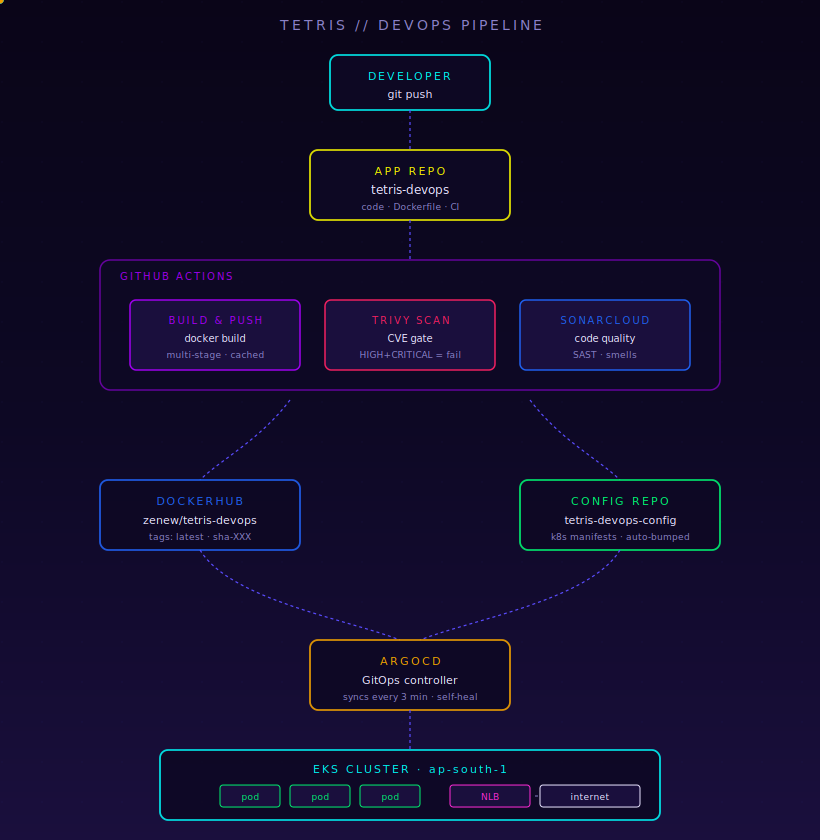
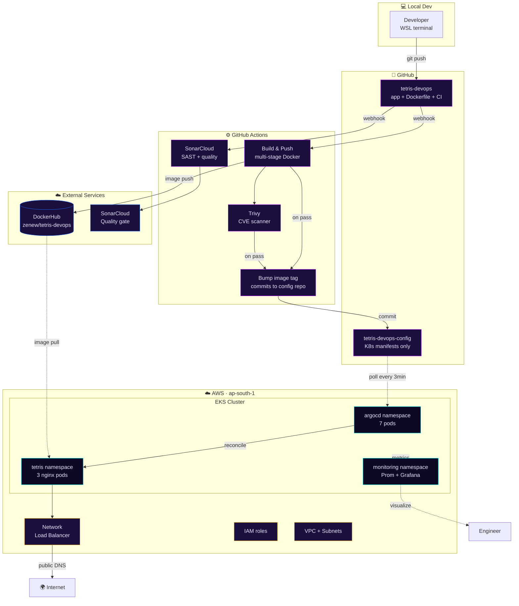
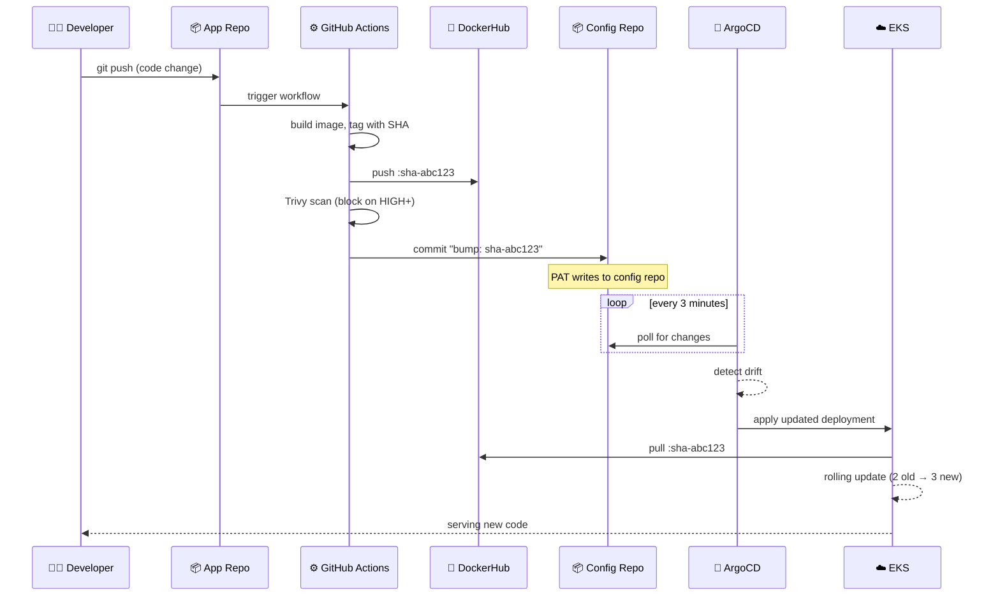
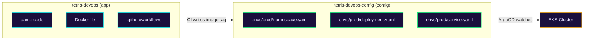
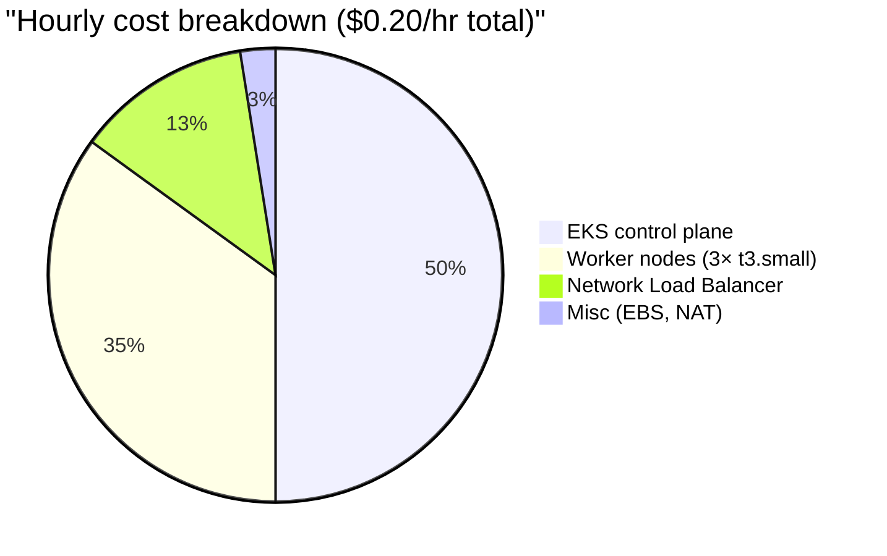

# 🏛️ Architecture

The detailed view of every component in the Tetris DevOps pipeline, how they fit together, and why each one is there.

---

## 🌀 The Live Pipeline

The animated diagram below shows real-time data flow through the pipeline — code traveling from your laptop all the way to a public Kubernetes endpoint, and metrics flowing back.

<div align="center">
  
</div>

> 💡 **Tip:** GitHub renders animated SVGs when referenced as images. If you're viewing this locally and the dots aren't moving, open the SVG file directly in a browser.

---

## 🗺️ Full Architecture (Mermaid)



---

## 🧩 Component Reference

### Application layer

| Component | What it does | Notes |
|-----------|--------------|-------|
| **Tetris game** | Vanilla HTML5 + Canvas + JS, ~350 LOC | No frameworks, no build step |
| **nginx (unprivileged)** | Serves static files inside the container | Runs as UID 101, listens on 8080 |

### Container layer

| Component | What it does | Notes |
|-----------|--------------|-------|
| **Multi-stage Dockerfile** | `prep` stage validates files, `runtime` stage is the final image | Final size ~48 MB |
| **`.dockerignore`** | Excludes `.git`, IDE files, secrets from build context | Layer cache friendly + security |
| **OCI labels** | Title, description, licenses | Visible in registries/scanners |
| **HEALTHCHECK** | `wget` against `127.0.0.1:8080/health` every 30s | Used for `docker ps` status; K8s uses its own probes |

### CI layer (`.github/workflows/ci.yml`)

| Job | Trigger | Gates on | Outputs |
|-----|---------|----------|---------|
| `build-and-push` | push to main / PR | — | Image at `zenew/tetris-devops:latest` + `:sha-XXX` |
| `trivy-scan` | After build, push only | HIGH+CRITICAL CVEs | Pass/fail |
| `sonarcloud` | All pushes | None (informational) | Quality report at sonarcloud.io |
| `bump-config` | After build + trivy pass, main only | — | Commit in config repo updating image tag |

### Registry layer

- **DockerHub:** `zenew/tetris-devops`
  - `:latest` — most recent main push
  - `:sha-<commit>` — permanent, immutable, used by GitOps for deterministic deploys

### GitOps layer

- **ArgoCD** installed in `argocd` namespace
- Watches: `https://github.com/wasimat404/tetris-devops-config` → `envs/prod/`
- Sync policy: `automated: { prune: true, selfHeal: true }`
- Reconcile interval: every 3 minutes (default)
- The Application object itself was created via UI but stored declaratively could go into the config repo for full bootstrap-from-Git

### Cluster layer (EKS)

| Component | Detail |
|-----------|--------|
| **Region** | `ap-south-1` (Mumbai) |
| **K8s version** | 1.30 |
| **Worker nodes** | 3× `t3.small` (2 vCPU, 2 GB RAM, 11-pod cap each) |
| **Networking** | VPC with public subnets across 3 AZs (eksctl default) |
| **Pod placement** | Tetris pods spread across all 3 nodes for redundancy |

### Application manifests (`tetris-devops-config/envs/prod/`)

```
namespace.yaml    → creates the 'tetris' namespace
deployment.yaml   → 3 replicas, resource limits, probes, security context
service.yaml      → type: LoadBalancer → provisions AWS NLB
```

Pinned image: `zenew/tetris-devops:sha-<commit>` (no `:latest` in production manifests — GitOps best practice).

### Observability layer

`kube-prometheus-stack` Helm chart installs:

| Component | Role |
|-----------|------|
| **Prometheus** | Scrapes metrics every 15s, 30 days retention |
| **Alertmanager** | Routes/dedupes alerts (not actively configured in this project) |
| **node-exporter** | DaemonSet, one per node, exposes host-level metrics |
| **kube-state-metrics** | Translates K8s API objects into Prometheus metrics |
| **Grafana** | Dashboards UI, 30+ pre-built dashboards out of the box |
| **prometheus-operator** | Manages Prometheus CRDs |

---

## 🔄 GitOps Flow in Detail

The most interesting part of the project. Walk through what happens on a single code change:



**Key properties of this flow:**

- **Atomic commits.** Each deploy is one commit in the config repo — auditable, revertible.
- **No `kubectl` after setup.** ArgoCD is the only thing that talks to the cluster API.
- **Self-healing.** If anyone runs `kubectl edit deployment tetris -n tetris`, ArgoCD reverts it within 3 minutes.
- **Drift visibility.** ArgoCD UI shows red "OutOfSync" the moment cluster ≠ Git.
- **Rollback = `git revert`.** One command on the config repo.

---

## 🔐 Security Architecture

Defense in depth across every layer:

```mermaid
flowchart LR
    subgraph Layer1["🌐 Network"]
        N1[Public NLB<br/>port 80 only]
        N2[nginx security headers<br/>X-Frame-Options · CSP-ready]
    end

    subgraph Layer2["📦 Image"]
        I1[Non-root user UID 101]
        I2[Minimal Alpine base]
        I3[Multi-stage<br/>no build tools in runtime]
        I4[apk upgrade<br/>CVE patches at build]
    end

    subgraph Layer3["☸️ Pod"]
        P1[runAsNonRoot: true]
        P2[runAsUser: 101]
        P3[allowPrivilegeEscalation: false]
        P4[capabilities: drop ALL]
    end

    subgraph Layer4["🔍 CI"]
        C1[Trivy on every push<br/>HIGH+CRITICAL gates build]
        C2[SonarCloud SAST]
        C3[secrets in GH Actions vault]
    end

    Layer1 --> Layer2 --> Layer3 --> Layer4

    classDef sec fill:#1a0f3d,stroke:#f02060,color:#e8e3ff
    class N1,N2,I1,I2,I3,I4,P1,P2,P3,P4,C1,C2,C3 sec
```



---

## 📦 The Two-Repo Pattern



**Why two repos:**

| Concern | One repo | Two repos |
|---------|----------|-----------|
| Setup complexity | ⬇ Simpler | ⬆ More moving parts |
| Audit trail of deploys | 😕 Mixed with code commits | ✅ Clean — every deploy is one commit |
| Rollback by `git revert` | 😕 Affects code too | ✅ Reverts ONLY the deploy |
| Permission separation | 😕 Anyone with repo access can deploy | ✅ Config repo can be locked down |
| ArgoCD scope | Watches a subfolder | Watches whole repo |
| Production-correctness | "It works" | What real shops do |

We picked two for the learning + the cleaner pattern.

---

## ⚙️ ArgoCD Setup

The `Application` object that wires Git → Cluster:

```yaml
apiVersion: argoproj.io/v1alpha1
kind: Application
metadata:
  name: tetris
  namespace: argocd
spec:
  project: default
  source:
    repoURL: https://github.com/wasimat404/tetris-devops-config
    targetRevision: main
    path: envs/prod
  destination:
    server: https://kubernetes.default.svc
    namespace: tetris
  syncPolicy:
    automated:
      prune: true       # Delete resources removed from Git
      selfHeal: true    # Revert manual cluster changes
    syncOptions:
      - CreateNamespace=true
```

Apply with:

```bash
kubectl apply -f application.yaml
```

(In a fully bootstrap-from-Git setup, this manifest would itself live in a Git repo and be applied by a "root" ArgoCD Application — the "app of apps" pattern.)

---

## 📊 Resource Inventory

What's actually running when everything is up:

| Namespace | Resource | Count | Purpose |
|-----------|----------|-------|---------|
| `kube-system` | aws-node | 3 | VPC CNI |
| `kube-system` | kube-proxy | 3 | Service IP routing |
| `kube-system` | coredns | 2 | Cluster DNS |
| `kube-system` | metrics-server | 2 | HPA / `kubectl top` |
| `tetris` | tetris (pods) | 3 | The game |
| `argocd` | argocd-* | 7 | GitOps engine |
| `monitoring` | prom+grafana+exporters | ~10 | Observability |

Total: ~30 pods across 3 nodes (cap 11 each = 33 max). Tight but works.

---

## 💸 Cost Breakdown

Per running hour:



**Storage** (when off): pennies for ECR/DockerHub. Effectively zero.

---

[← Back to README](./README.md)
