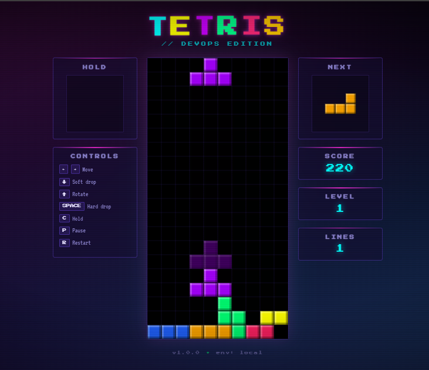
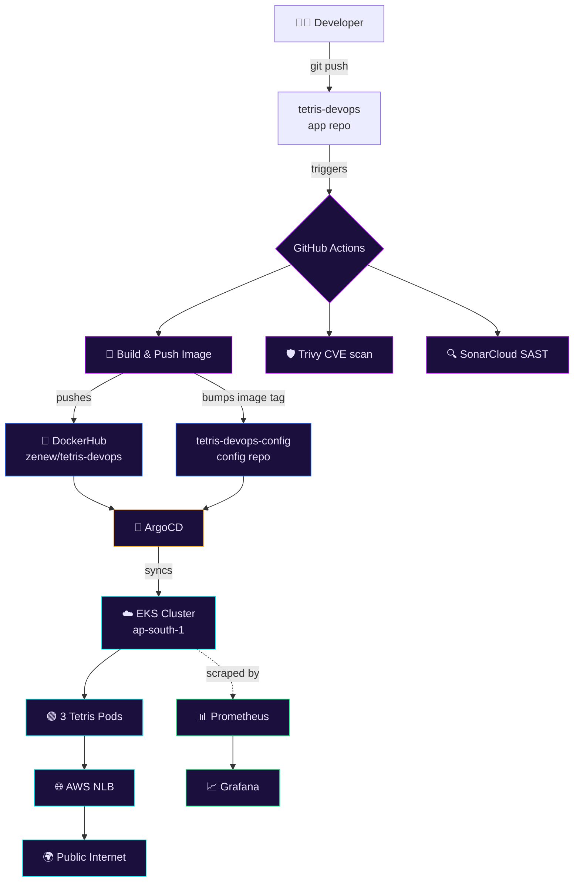
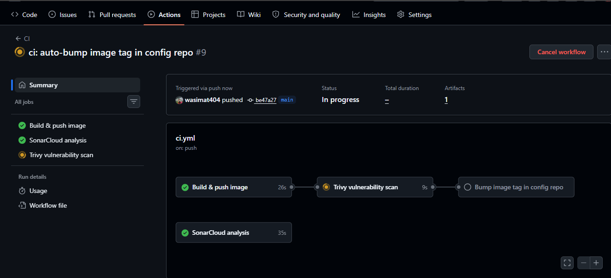
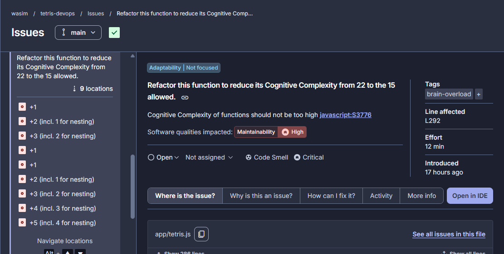
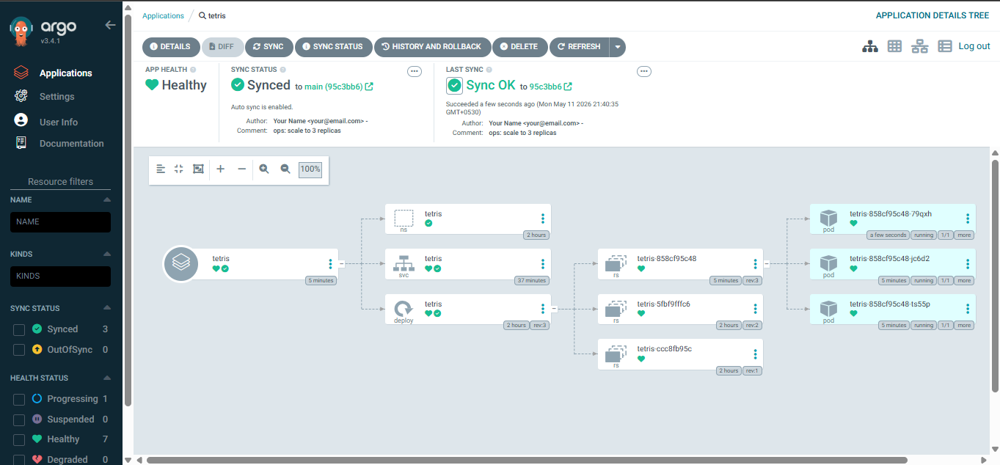
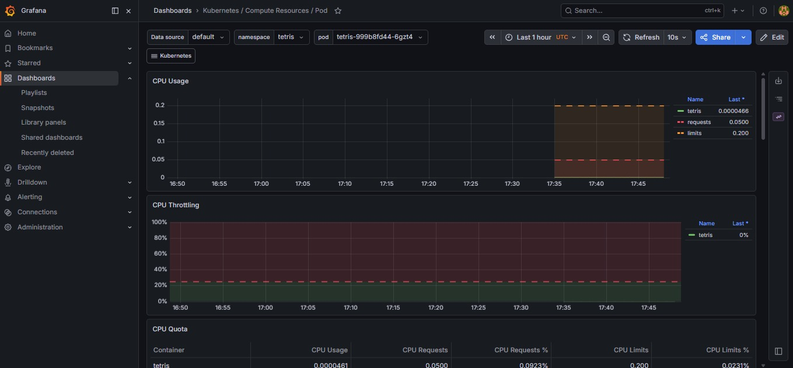

<div align="center">

# 🎮 TETRIS // DevOps Edition

**A colorful Tetris game taken end-to-end from code to a production-shaped Kubernetes deployment on AWS — with CI/CD, security scanning, GitOps, and observability.**

[](https://github.com/wasimat404/tetris-devops/actions)
[](https://hub.docker.com/r/zenew/tetris-devops)
[](https://aquasecurity.github.io/trivy/)
[](https://sonarcloud.io)
[](https://argo-cd.readthedocs.io/)
[](https://aws.amazon.com/eks/)
[](https://prometheus.io/)



</div>

---

## 🚀 TL;DR

A Tetris game wrapped in **every layer of a modern DevOps pipeline.** The game itself is intentionally simple (vanilla JS, no frameworks) so the focus stays on the infrastructure around it.

> **One `git push` to the app repo →** CI builds the image, scans it for CVEs, runs SAST, pushes to DockerHub, auto-bumps the image tag in a separate config repo. ArgoCD detects the change and rolls out a zero-downtime update on AWS EKS. Prometheus scrapes metrics the whole time. Grafana visualises it.

Zero manual `kubectl` after the initial setup.

---

## 🏗️ The Pipeline



> 📐 See [**ARCHITECTURE.md**](./ARCHITECTURE.md) for the full animated diagram + deeper component breakdown.

---

## 🧰 Stack

| Layer | Tool | What it does here |
|------|------|-------------------|
| **App** | Vanilla HTML5 + Canvas + JS | The game. No framework. ~350 LOC. |
| **Web server** | nginx (unprivileged Alpine) | Serves static files. Non-root, hardened headers. |
| **Container** | Docker (BuildKit, multi-stage) | ~48 MB image, CVE-patched, healthchecked. |
| **Registry** | DockerHub | Public image hosting. |
| **CI** | GitHub Actions | Build → scan → push → bump config tag. |
| **Vulnerability scan** | Trivy | Fails build on HIGH/CRITICAL CVEs. |
| **Code quality / SAST** | SonarCloud | Bugs, smells, security hotspots. |
| **Orchestration** | Amazon EKS (Kubernetes 1.30) | 3× t3.small worker nodes. |
| **Networking** | AWS NLB | Public ingress, L4 load balancing. |
| **GitOps** | ArgoCD | Continuously reconciles cluster to Git. |
| **Metrics** | Prometheus | Scrapes every 15s, stores time-series. |
| **Dashboards** | Grafana | Pre-built K8s dashboards + custom. |

---

## 📸 The Journey, Stage by Stage

### Stage 1 — The Game
Vanilla JS Tetris with all 7 tetrominoes, 7-bag randomization, wall kicks, hold piece, ghost piece, level-based speed-up. Neon arcade aesthetic with CRT scanlines and animated title.


### Stage 2 — Containerization
Multi-stage Dockerfile producing a ~48MB hardened image. Runs as non-root (UID 101), exposes `/health` endpoint for K8s probes, security headers baked into nginx config, all base packages upgraded to patch CVEs at build time.

```dockerfile
FROM nginxinc/nginx-unprivileged:1.27-alpine AS runtime
# ... non-root, healthcheck, /health, security headers
```

### Stage 3 — CI Pipeline
Four parallel/sequential jobs on every push to `main`:



| Job | Purpose | Gate |
|-----|---------|------|
| **Build & push** | Multi-arch image build, layer-cached | Build must pass |
| **Trivy scan** | CVE check on the pushed image | HIGH+CRITICAL fail the run |
| **SonarCloud** | Code quality + SAST | Currently informational |
| **Bump config** | Updates image tag in config repo | Triggers ArgoCD downstream |

### Stage 3.5 — Security Scanning

Two complementary tools running on every push:

- **Trivy** scans the built **image** for known CVEs in the OS packages and dependencies. Initially flagged 33 HIGH/CRITICAL findings in the base image — fixed in one line (`apk upgrade --no-cache`).
- **SonarCloud** scans the **source code** for bugs, code smells, and security hotspots — SAST coverage.



### Stage 4 — Kubernetes on EKS

EKS cluster in `ap-south-1` (Mumbai), provisioned with `eksctl` in ~15 minutes. 3× t3.small worker nodes, automatic VPC + subnets + IAM roles.

Three K8s manifests deploy Tetris:
- **Namespace** — isolation
- **Deployment** — 3 replicas, resource limits, liveness + readiness probes, full security context (non-root, dropped capabilities, no privilege escalation)
- **Service** (`type: LoadBalancer`) — auto-provisions an AWS NLB with public DNS

### Stage 5 — GitOps with ArgoCD

This is where the project gets interesting. Cluster state is no longer something humans `kubectl apply` to — it's defined entirely by Git, and ArgoCD continuously reconciles.

**Two-repo separation:**
- [`tetris-devops`](.) — app code, Dockerfile, CI
- [`tetris-devops-config`](https://github.com/wasimat404/tetris-devops-config) — Kubernetes manifests, environment configs

CI in this repo doesn't just push images — it commits new image tags to the config repo. ArgoCD picks it up within 3 minutes. Zero manual deployment.



### Stage 6 — Observability

`kube-prometheus-stack` Helm chart installed in the `monitoring` namespace. Bundles Prometheus, Alertmanager, node-exporters, kube-state-metrics, and Grafana — all pre-wired with service discovery and dashboards.



Real-time metrics from every layer: nodes, pods, namespaces, the Kubernetes API server itself. Zero dashboard config — kube-prometheus-stack ships with ~30 pre-built dashboards.

---

## 📁 Repo Structure

This project spans **two repositories** intentionally — a real-world GitOps pattern that separates **what runs** from **what's running**.

### This repo (`tetris-devops`) — app + CI

```
tetris-devops/
├── app/                    # Game source — vanilla HTML/CSS/JS
│   ├── index.html
│   ├── style.css
│   └── tetris.js
├── .github/workflows/
│   └── ci.yml              # Build · Trivy · Sonar · Bump config
├── screenshots/            # Docs assets
├── assets/                 # SVG diagrams
├── Dockerfile              # Multi-stage, non-root, hardened
├── nginx.conf              # Security headers · /health · stub_status
├── .dockerignore
├── README.md               # ← you are here
└── ARCHITECTURE.md         # Detailed component breakdown
```

### Sister repo ([`tetris-devops-config`](https://github.com/wasimat404/tetris-devops-config)) — what ArgoCD watches

```
tetris-devops-config/
└── envs/
    └── prod/
        ├── namespace.yaml
        ├── deployment.yaml
        └── service.yaml
```

---

## 🏃 Run Locally

The game is just static files — three ways to try it:

```bash
# Option A — Python (already on most systems)
cd app && python3 -m http.server 8080

# Option B — Run the container
docker run --rm -p 8080:8080 zenew/tetris-devops:latest

# Option C — Just open app/index.html in a browser
```

Then visit **http://localhost:8080**.

### Controls

| Key | Action |
|-----|--------|
| ← → | Move |
| ↓ | Soft drop |
| ↑ | Rotate |
| **Space** | Hard drop |
| **C** | Hold piece |
| **P** | Pause |
| **R** | Restart |

---

## 🚢 Deploy It Yourself

Full deployment guide is condensed here. The detailed walkthrough is what built this project step by step.

### Prerequisites
- AWS account (EKS costs ~$4/day while running)
- DockerHub account
- WSL2 / Linux / macOS terminal with: `aws-cli`, `docker`, `kubectl`, `eksctl`, `helm`, `git`

### Build & push the image (one-time, manual)

```bash
docker build -t YOUR-DH-USER/tetris-devops:0.1.0 .
docker push YOUR-DH-USER/tetris-devops:0.1.0
```

### Create the EKS cluster

```bash
eksctl create cluster \
  --name tetris-eks \
  --region ap-south-1 \
  --version 1.30 \
  --node-type t3.small \
  --nodes 3 \
  --managed
```

⏱️ ~15 minutes.

### Deploy the app

If you forked the config repo:
```bash
kubectl apply -f https://raw.githubusercontent.com/wasimat404/tetris-devops-config/main/envs/prod/namespace.yaml
kubectl apply -f https://raw.githubusercontent.com/wasimat404/tetris-devops-config/main/envs/prod/deployment.yaml
kubectl apply -f https://raw.githubusercontent.com/wasimat404/tetris-devops-config/main/envs/prod/service.yaml
```

Grab the public NLB URL:
```bash
kubectl get svc -n tetris tetris -o jsonpath='{.status.loadBalancer.ingress[0].hostname}'
```

### Install ArgoCD (GitOps)

```bash
kubectl create namespace argocd
kubectl apply -n argocd -f https://raw.githubusercontent.com/argoproj/argo-cd/stable/manifests/install.yaml
```

Then create an `Application` pointing at your config repo. See [ARCHITECTURE.md](./ARCHITECTURE.md#argocd-setup).

### Install monitoring stack

```bash
helm repo add prometheus-community https://prometheus-community.github.io/helm-charts
helm install monitoring prometheus-community/kube-prometheus-stack \
  --namespace monitoring --create-namespace \
  --set grafana.adminPassword=admin
```

### 🔥 Teardown (IMPORTANT)

EKS bills by the hour. Always tear down when done:

```bash
# Delete service first so AWS deletes the NLB
kubectl delete application tetris -n argocd   # stop ArgoCD recreating it
kubectl delete service tetris -n tetris

# Then nuke the cluster
eksctl delete cluster --name tetris-eks --region ap-south-1
```

Verify zero leftovers:
```bash
aws elbv2 describe-load-balancers --region ap-south-1
aws ec2 describe-instances --region ap-south-1 \
  --filters "Name=instance-state-name,Values=running"
```

Both should be empty.

---

## 🎯 What I Learned

Real takeaways from building this — the kind of thing that only happens hands-on:

- **`runAsNonRoot: true` needs a numeric UID.** K8s won't trust the image's declared user (`nginx`) — too easy to spoof. Solved with `runAsUser: 101`.
- **`localhost` inside containers is ambiguous.** Resolves to IPv6 (`::1`) first on Alpine; healthcheck wget fails when IPv6 isn't listening. Fixed by hardcoding `127.0.0.1` in HEALTHCHECK.
- **t3.small caps at 11 pods.** Not a CPU or memory limit — it's AWS networking (ENI IP addresses). Bit me when installing kube-prometheus-stack; fix was scaling out, not up.
- **ArgoCD's self-heal is *aggressive*.** Try to delete a Service it manages, ArgoCD recreates it within 3 minutes. Teardown order matters — kill the ArgoCD `Application` first.
- **DockerHub layer dedup is magical.** First push: 30 MB uploaded. `latest` push: 0 bytes (just a tag pointer). Same for re-pushes of unchanged base layers.
- **CVE patching is one apk upgrade line.** Initial Trivy scan: 33 HIGH/CRITICAL. After `apk update && apk upgrade --no-cache`: 0.
- **GitOps changes how you think about deployments.** You stop running `kubectl apply` and start treating Git as the cluster's API.

---

## 🛣️ Future Improvements

- [ ] TLS via cert-manager + Let's Encrypt
- [ ] Replace NLB with ALB Ingress for HTTP routing
- [ ] Add HPA (Horizontal Pod Autoscaler)
- [ ] Custom Grafana dashboard for nginx metrics via `stub_status`
- [ ] Promote to multi-environment GitOps (dev/staging/prod folders in config repo)
- [ ] Helm chart instead of raw manifests
- [ ] Terraform for cluster provisioning (replace eksctl)
- [ ] Loki for log aggregation alongside Prometheus
- [ ] SLO definitions + Prometheus alerts

---

## 💰 Cost

Running cost (while EKS is up):

| Item | Hourly | Daily |
|------|--------|-------|
| EKS control plane | $0.10 | $2.40 |
| 3× t3.small worker nodes | $0.069 | $1.65 |
| AWS Network Load Balancer | $0.025 | $0.60 |
| Misc (EBS, NAT) | ~$0.01 | ~$0.20 |
| **Total** | **~$0.20** | **~$4.85** |

DockerHub, GitHub Actions (public repo), SonarCloud (public repo), Trivy: **all free.**

---

## 📜 License

MIT

---

<div align="center">

**Built one push at a time.**

`code → ci → scan → push → bump → sync → deploy → observe`

</div>
